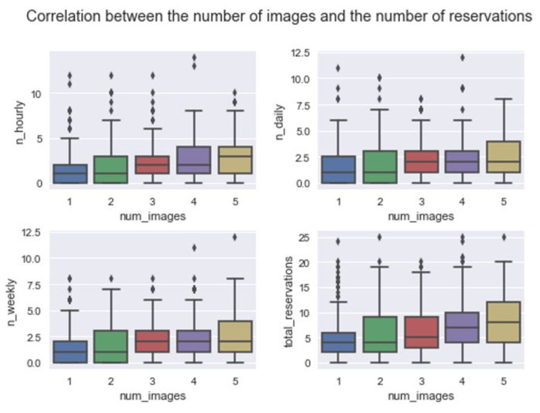

# Case Study of Rental on Turo

- By NK Zhehua Zou

### Table of the contents
1- Preprocess data   
2- Exploratory data analysis of combined data  
3- Conclusion  
4- Continue study  

### 1. Process data
1.1- Sizes of the original datasets are 6376 rows x 2 columns and 1000 rows x 7 columns, they have involved 1000 vehicles and 6376 transactions.  
1.2- Perfect quality datasets, they don't have missing values and outliers in datasets.  
1.3- Although the case requires an analysis based on the total reservations, I am still counting the data group by hourly, daily, weekly, and total reservations, then merging with the dataset of vehicles. I will show you the reason on the next.  
1.4- I create a new column named price_delta = actual_price - recommended_price, but I don't need to investigate the correlations with other features since it has a strong positive correlation with actual price. I will tell you why I need to create this column on the next.  

### 2. Exploratory data analysis of combined data
##### 2.1- Distribution based on reservation type.  
- Let's assume that hourly rental if < 24 hours, daily rental if >= 24 hours & < 7 days, and weekly rental if >= 7 days.  
- Relatively uniform distribution. but it might be due to the uneven distribution of the sample or the difference of definition of the type, I need more information to verify the accuracy.  

##### 2.2- Overview of the vehicles data  

- The number of vehicles without 'instantly bookable' is significantly greater than the number of vehicles with 'instantly bookable'. The reason is most of the vehicles come from family spare cars, or cost factors, or security considerations? I need more information to do further analysis.  
- Most of the actual price between 50 to 100 USD, different with the recommended price, range between -10 to 40 USD.  
- The number of images and the number of street-parked are relatively uniform distribution.  
- Most of the car descriptions are less than 50 characters.  

##### 2.3- Correlation between each feature

- Price includes actual price, recommended price, and price delta; the number of reservations includes all type of reservations.    
- Strong correlation between technology, price, and the number of reservations.  
- Strong correlation between the number of images and the number of reservations.  
- Street-parked and description have not impact to reservations.  

##### 2.4- Correlation between actual price, recommended price based on technology

- This is an interesting phenomenon, the average actual price is higher than the average recommended price, but with the recommended price rise, the actual price goes down if the car comes with 'instantly bookable'.  
- Perhaps the number of high-end cars installed technology equipment is relatively small, resulting in the sample can not accurately reflect the correlation? I need more information to investigate this phenomenon.  
- Because the car tenants can not see the recommended price when they rental a car on Turo, and the actual price has a positive correlation with recommended price in most of the time, so I just need to analyze by the actual price on the next.  

##### 2.5- Correlation between technology and price

- I do not understand why the average price of the vehicles with 'instantly bookable' is lower than that the vehicles without 'instantly bookable'.  
- Is Turo own these technologized vehicles? Or just because of these technologized vehicles concentrated in the low-end vehicle's market?  
- I need more information to investigate this phenomenon. for example, similar prices and similar amounts in the same level of vehicles.  
- I shall do an A/B testing to figure out what is the reasonable price for technologized vehicles in the future.  

##### 2.6- Correlation between technology and reservations

- Technology is assistant owners to increase transactions, but it only concentrated in the hourly rental since unlocked with the mobile phone can effectively reduce the processing time.  
- Technology is not much impact on daily rental and weekly rental, but the reason might be is technologized vehicles occupy a small percentage of the market.  
- I still need more data to support this argument.  

##### 2.7- Correlation between reservations, price, and technology

- Lower price, more reservations.  
- 50 to 100 USD is the most popular price range.  
- The effect from technology significantly less than the effect from the price.  
- I still need more data to do an A/B testing to verify this opinion.  
- I found that it considers renting a day even thought you just rent an hour on Turo, but sometimes it still considered as a day even thought you rent more than 24 hours. Because you will get 1% discount if you rent 6 days, or 15% discount if your rental more than 7 days. So the price for one hour is equal to the price for one day, the price for 6 days is equal to the price for 7 days. This factor will make many people upgrade their reservation type. I need more information to make further analysis.

- The actual prices of most of the vehicles are higher than the recommended prices, but a considerable part of the technologized vehicles made the actual price under the recommended price, this is an interesting phenomenon.  
- The vehicle has a greater chance to be reserved if the actual price under the recommended prices.  

##### 2.8- Correlation between images and reservations

- More images on the website, more reservations.

##### 2.9- About the description

- The length of description has no effect on the reservations, which means that the car owner should spend more time on the photo than the text description.  
- On the other hand, I should consider the establishment of a keyword analysis system,  because the additional requirements will have a great impact on reservations. For example, I found an owner say it will charge 200 USD if smoking in the car since he is a detail-oriented person. I will worry about that can I diet in the car? How about I travel with my pets? In order to avoid this trouble, I will not rent his car, even if he is almost filled with 250 words.  

##### 2.10- Compound features of technology and street-parked

- I try to find out if the Compound features of technology and street will have an impact on the reservation, but the fact is I failed on my hypothesis, even if it is more convenience if the car can be street parking and unlocked by the mobile phone.  
- The reason might be is the unevenness of the samples, it makes me more convinced that A / B Testing must be done once.  

### 3. Conclusion

- Technology has an impact on the reservations, but it concentrated in the low-end market.  
- Lower actual price and lower price delta, make more reservations. The most popular price range between 50 to 100 USD, the most popular price delta range between -10 to 40 USD.  
- More images also make more reservations.  
- The length of the description and the status of street-parked have not an impact on the reservation.  
- The average actual price of the technologized vehicles is less than the average actual price of the non-technologized vehicles, even less than recommended price?  

### 4. Continue study

- This analysis has a significant deviation with the real situation because I don't have many important features that affect prices and reservations, another reason is the uneven distribution of the sample.  
- I suggest creating a technology selection on the user page and take an A/B testing, then pick the equal number samples from technologized vehicles and non-technologized vehicles based on the same level, also add the following features into the dataset, such as vehicle's make, model, year, feedback, rate, and age limit. Therefore I can make a more efficient analysis.  
- About the recommendation system.  
a) We can build a recommendation system based on collaborative filtering, content-based filtering or hybrid recommender systems.  
b) Collaborative filtering is based on the assumption that people who agreed in the past will agree in the future, and that they will like similar kinds of items as they liked in the past. In order to provide accurate recommendations, collaborative filtering requires a lot of user information.  
c) Content-based filtering methods are based on a description of the item and a profile of the user’s preference. Content-based filtering requires only a small amount of information to start, but this method is very limited (for example, this method can only be similar to the original seed recommendations).
